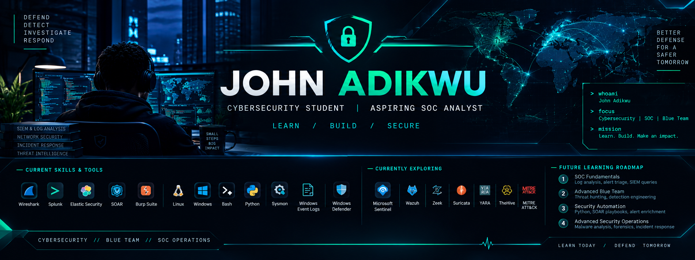

<!-- ===================================================== -->
<!--                 JOHN ADIKWU PROFILE                   -->
<!-- ===================================================== -->

<div align="center">



<br/>

# JOHN ADIKWU

### Cybersecurity Student | Aspiring SOC Analyst

**Blue Team • Security Operations • Threat Detection**

*Learning to detect threats, investigate incidents, and build a safer digital world.*

<br/>

[](YOUR_GITHUB_URL)
[](YOUR_LINKEDIN_URL)

</div>

---

## `01 // WHOAMI`

```bash
┌──(john㉿cybersec)-[~]
└─$ whoami

John Adikwu

┌──(john㉿cybersec)-[~]
└─$ cat about.txt

Cybersecurity student focused on defensive security,
SOC operations, threat detection, and incident investigation.

Currently developing practical skills in SIEM operations,
endpoint monitoring, network analysis, and security automation.

Career Goal:
Become a skilled SOC Analyst and contribute to
building a safer and more secure digital environment.
```

I'm a cybersecurity student passionate about understanding how security teams monitor systems, identify suspicious activities, investigate threats, and respond to security incidents.

My learning journey focuses on practical cybersecurity experience through hands-on labs, security investigations, technical documentation, and continuous learning.

I enjoy breaking down security concepts, analyzing logs, and documenting my findings to strengthen my understanding of real-world security operations.

---

## `02 // CURRENT SKILLS & SECURITY ARSENAL`

### SIEM & Security Operations

<p align="left">


</p>

### Endpoint Detection & Response (EDR)

<p align="left">


</p>

### Network & Web Security

<p align="left">


</p>

### Operating Systems & Scripting

<p align="left">


</p>

---

## `03 // CYBERSECURITY FOCUS`

| Security Domain | Focus |
|---|---|
| SOC Operations | Alert triage, investigation and reporting |
| SIEM | Security event monitoring and log analysis |
| EDR | Endpoint monitoring and suspicious activity investigation |
| Network Security | Packet analysis and network traffic inspection |
| Incident Response | Investigation, escalation and documentation |
| Threat Detection | Identifying suspicious processes and activities |
| Security Automation | Understanding automated security workflows |

---

## `04 // FUTURE LEARNING ROADMAP`

> Building on my current cybersecurity foundation through continuous learning and practical application.

### Phase 01 — Advanced SOC Operations
- Advanced Splunk SPL and Elastic KQL
- SIEM detection rules and correlation
- Advanced alert triage and investigation
- Security monitoring and escalation workflows

### Phase 02 — Threat Hunting & Detection Engineering
- MITRE ATT&CK framework
- Threat hunting methodologies
- Sigma detection rules
- IOC analysis and threat intelligence
- Detection engineering fundamentals

### Phase 03 — Advanced Security Operations
- Microsoft Sentinel
- Wazuh
- Zeek and Suricata
- Advanced EDR investigation
- Digital forensics and Windows artifacts

### Phase 04 — Security Automation
- Advanced Python scripting
- SOAR playbook development
- Automated alert enrichment
- Incident response automation
- Security workflow optimization

*These are future learning goals, not claims of current proficiency.*

---

## `05 // PRACTICAL SECURITY WORK`

My practical learning focuses on applying cybersecurity concepts to controlled lab environments and documenting investigation findings.

### 🔍 SOC Alert Investigation
Analyzing suspicious process activity, parent-child relationships, command-line arguments, and security event data.

### 🛡️ Endpoint Monitoring
Working with Sysmon, Windows Event Logs, and endpoint security concepts to understand suspicious activity.

### 📊 Security Alert Reporting
Practicing alert triage, investigation documentation, escalation decisions, and clear incident reporting.

### 🌐 Network Security Analysis
Exploring network traffic and packet analysis using Wireshark.

### 🧪 Security Lab Development
Building virtualized cybersecurity lab environments for practical security exercises.

---

## `06 // FEATURED PROJECTS`

<div align="center">

| Project | Description | Status |
|---|---|---|
| SOC Investigation Notes | Security alert investigation and documentation | In Progress |
| Cybersecurity Lab Environment | Virtualized practical security lab | In Progress |
| Security Learning Repository | Technical notes and cybersecurity exercises | In Progress |
| SOC Alert Reporting | Triage, escalation and reporting exercises | Learning |

</div>

*Project repositories and detailed write-ups will be linked here as they are published.*

---

## `07 // GITHUB STATISTICS`

<div align="center">


<br/>


</div>

---

## `08 // CONNECT`

<div align="center">

I'm always interested in connecting with cybersecurity learners, SOC analysts, security professionals, and people passionate about defensive security.

<br/>

[](YOUR_LINKEDIN_URL)

[](YOUR_GITHUB_URL)

<br/>

**LEARN TODAY. DEFEND TOMORROW. GROW ALWAYS.**

</div>
